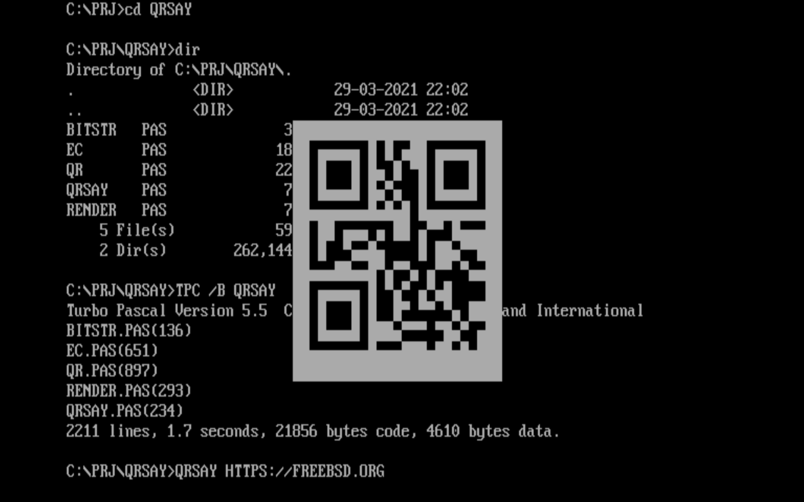
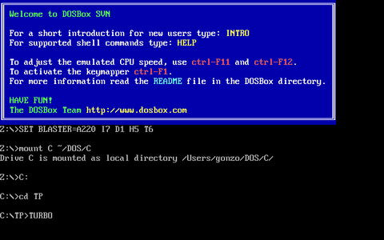

# Just some good clean DOS fun

## QRSAY

CLI QR code generator for MS DOS. TP5.5+



```
SYNTAX: QRSAY [options] /F file | MESSAGE
OPTIONS:
  /I        Invert image, use light on dark theme
  /L x      Request specific EC level, values: L, M, Q, H
  /M x      Request specific mask pattern, values: 0-7
  /N        Do not render QR code, only print its info
  /O file   Save QR code as text to the specified file
  /V xxx    Request specific version, values: 1-20
```

## SNEAKERS.PAS 

Re-creation of de-cryption scene in Sneakers movie using DOS codegenerator functionality. TP4+


